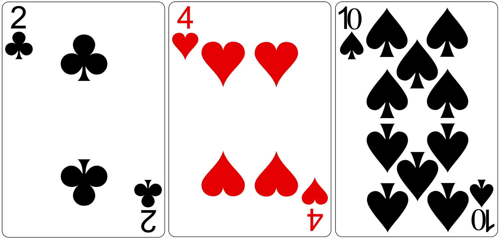

# Playing Cards

A marble **does not** have an orientation. It [cannot be flipped][flipped] or
rotated. It *always* appears the same no matter how it's placed on the table.


> "A **permutation** of a set of objects is an arrangement of those objects
> into a particular order." - wikipedia

Can we write `Code` and have it look nice?

```
class Something
  def do_nothing
    # does nothing
  end
end
```

---

## Getting Oriented

Playing cards, however, *do* have an orientation. We can flip any of the three
cards and we'll end up with a *different* position.



There are over 43 quintillion legal positions of the Rubik's Cube.

- It would take **thirteen hundred million years** to see every position if you
  were able to view one thousand per second.
- If we stacked 43 quintillion pennies, the stack would be tall enough to reach
  the sun and return to the earth **four thousand billion times**.

[flipped]: http://www.youtube.com/watch?v=CuVB8YpQlYQ
